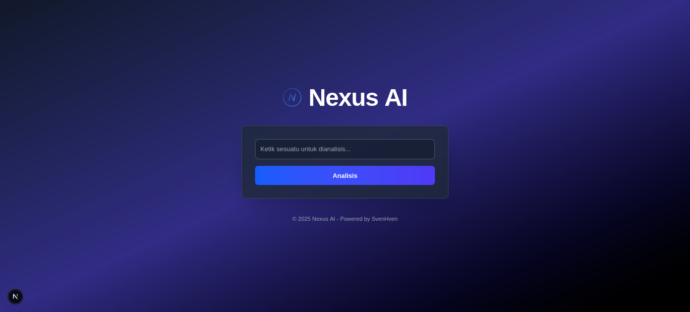

# Nexus AI

Nexus AI is an open-source, decentralized AI agent platform designed to empower everyone with cutting-edge artificial intelligence tools. Built with a modern tech stack and a sleek, futuristic interface, Nexus AI aims to be a hub for knowledge sharing, task automation, and community-driven innovation. Whether you're a developer, researcher, or enthusiast, Nexus AI invites you to explore, contribute, and shape the future of AI.

## Features

- **Sentiment Analysis**: Analyze text sentiment with a pre-trained AI model (distilbert-base-uncased-finetuned-sst-2-english).
- **Modern UI**: A responsive, animated interface powered by Next.js, Tailwind CSS, and Framer Motion.
- **Scalable Backend**: FastAPI-driven API with SQLite for lightweight storage.
- **Extensible**: Modular design ready for multi-agent expansion.



## Getting Started

### Prerequisites

- **Python**: 3.13+ (compiled from source or via package manager)
- **Node.js**: 20.x.x (with npm 9+)
- **Git**: For cloning and contributing

### Installation

1. **Clone the Repository**

    ```bash
    git clone https://github.com/nexus-ai/nexus-ai.git
    cd nexus-ai
    ```

2. **Setup Backend**

    ```bash
    cd backend
    python3 -m venv venv
    source venv/bin/activate
    pip install -r requirements.txt
    python main.py
    ```

    Backend runs on [http://localhost:8000](http://localhost:8000).

3. **Setup Frontend**

    ```bash
    cd ../frontend
    npm install
    npm run dev
    ```

    Frontend runs on [http://localhost:3000](http://localhost:3000).

4. **Test It Out**

   Open [http://localhost:3000](http://localhost:3000) in your browser. Enter text (e.g., "I am happy") and click "Analyze" to see the sentiment result.

## Project Structure

```plaintext
nexus-ai/
├── backend/            # FastAPI backend with AI logic
│   ├── db/             # SQLite database
│   ├── main.py         # Main API entry point
│   └── venv/           # Python virtual environment
├── frontend/           # Next.js frontend
│   ├── app/            # Pages and routes
│   ├── public/         # Static assets (e.g., logo.svg)
│   └── components/     # Reusable UI components
├── docs/               # Documentation and assets (e.g., screenshot.png)
├── README.md           # Project overview
└── LICENSE             # Apache 2.0 License
```

## Contributing

We believe in the power of community! Nexus AI is just the beginning—join us to make it extraordinary. Here’s how you can contribute:

### Multi-Agent Expansion

- **Add New Agents**: Extend the platform with agents for summarization, question answering, code generation, etc.
  - Example: Create `backend/agents/summarizer.py` using `facebook/bart-large-cnn`.
- **Modularize**: Help refactor the backend for seamless agent integration.

### Development Ideas

- **UI Enhancements**: Add dark/light mode, particle animations, or advanced visualizations.
- **Features**: Implement history tracking, user authentication, or real-time collaboration.
- **Performance**: Optimize model loading, add caching, or integrate cloud deployment.

### How to Contribute

1. **Fork the repository**.

2. **Create a branch**: `git checkout -b feature/your-idea`.

3. **Commit changes**: `git commit -m "Add cool feature"`.

4. **Push**: `git push origin feature/your-idea`.

5. **Open a Pull Request**—we’d love to review your work!

Check out `CONTRIBUTING.md` (coming soon) for detailed guidelines.

## Tech Stack

- **Backend**: FastAPI, Python 3.13, Transformers (Hugging Face), SQLite
- **Frontend**: Next.js 15 (Turbopack), TypeScript, Tailwind CSS, Framer Motion
- **License**: Apache 2.0

## Roadmap

- Basic sentiment analysis
- Multi-agent support (summarization, Q&A, etc.)
- History tracking and visualization
- Deployable Docker image
- Community-driven agent marketplace

## License

Nexus AI is licensed under the Apache 2.0 License. Feel free to use, modify, and distribute it as you see fit!

## Join the Future

Nexus AI is more than a project—it’s a movement. Let’s build a decentralized AI ecosystem together. Star this repo, fork it, and let’s create something amazing. Questions? Ideas? Reach out via GitHub Issues or connect with us on X.

Built with ❤️ by svenhven and the open-source community.